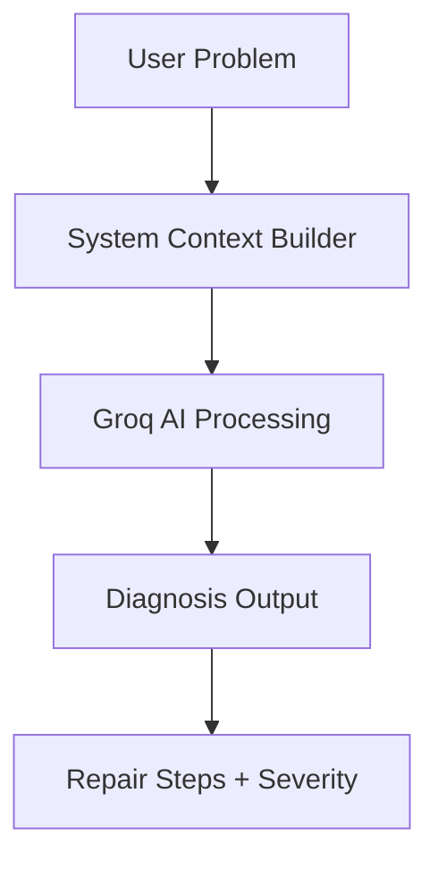

# 🚗 AutoAidX

### ⚡ AI-Powered Automotive Care System

<p align="center">
  <b>Diagnose • Repair • Learn • Automate</b><br><br>
  
  
  
  
</p>

---

## 🚀 Live Experience (Concept)

> 💡 Chat with an AI mechanic like ChatGPT for your car
> ⚡ Get instant repair steps
> 🧰 Fix issues without going to mechanic

---

## ✨ Features

<details>
<summary>🔍 Click to Expand Features</summary>

* 🤖 AI-powered diagnostics (Groq AI)
* 💬 Real-time mechanic chat
* 🛠️ Admin panel (brands, models, issues)
* 🖼️ Image upload (ImageKit)
* 🔐 JWT authentication
* ⚡ One-command full project start

</details>

---

## 🧠 AI Mechanic Flow



---

## 📂 Project Structure

<details>
<summary>📁 View Folder Structure</summary>

```bash
auto/
├── admin/
├── backend/
├── frontend/
├── package.json
└── README.md
```

</details>

---

## 🛠️ Tech Stack

<p align="center">

| Layer        | Tech                    |
| ------------ | ----------------------- |
| 🎨 Frontend  | React + Vite + Tailwind |
| ⚙️ Backend   | Node.js + Express       |
| 🗄️ Database | MongoDB                 |
| 🤖 AI        | Groq API                |
| 🖼️ Storage  | ImageKit                |

</p>

---

## ⚡ Quick Setup

<details>
<summary>🚀 Click to Setup Project</summary>

### 1️⃣ Clone Repo

```bash
git clone <your-repo-url>
cd auto
```

### 2️⃣ Install All Dependencies

```bash
npm install
cd frontend && npm install && cd ..
cd backend && npm install && cd ..
cd admin && npm install && cd ..
```

### 3️⃣ Setup Environment

```env
PORT=5000
MONGO_URI=your_mongodb_uri
GROQ_API_KEY=your_key
IMAGEKIT_PUBLIC_KEY=your_key
IMAGEKIT_PRIVATE_KEY=your_key
IMAGEKIT_URL_ENDPOINT=your_url
ADMIN_EMAIL=admin@example.com
ADMIN_PASSWORD=your_password
JWT_SECRET=secret
```

### 4️⃣ Run Project

```bash
npm run dev
```

</details>

---

## 🌐 Running URLs

| Service  | URL                   |
| -------- | --------------------- |
| Frontend | http://localhost:5173 |
| Admin    | http://localhost:5174 |
| Backend  | http://localhost:5000 |

---

## 🎯 Why This Project is Cool

* 🚀 Saves mechanic cost
* 🤖 AI-powered learning
* 🧑‍💻 Full-stack real-world project
* 💼 Perfect for portfolio

---

## 📤 GitHub Push

<details>
<summary>📦 Push Code to GitHub</summary>

```bash
git init
git add .
git commit -m "AutoAidX 🚗"
git branch -M main
git remote add origin <repo-link>
git push -u origin main
```

</details>

---

## ⚠️ Requirements

* Node.js v18+
* MongoDB Atlas
* Groq API Key
* ImageKit Account

---

## ❤️ Made With Passion

<p align="center">
🔥 Built by AutoAidX Team 🔥  
</p>

---

## ⭐ Bonus Tip

👉 Add screenshots like this:

```md

```

👉 Add demo video:

```md
[Watch Demo](https://your-video-link.com)
```

---

## 🧠 Future Ideas

* 🔊 Voice-based diagnosis
* 📱 Mobile app
* 🚗 OBD sensor integration
* 🧠 Self-learning AI
.
---
